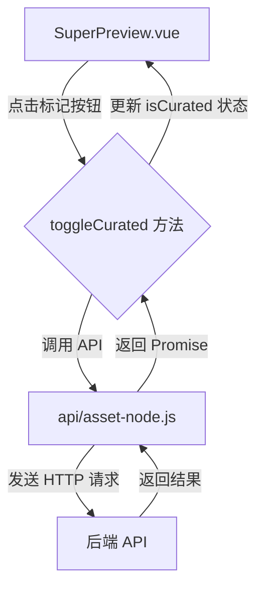
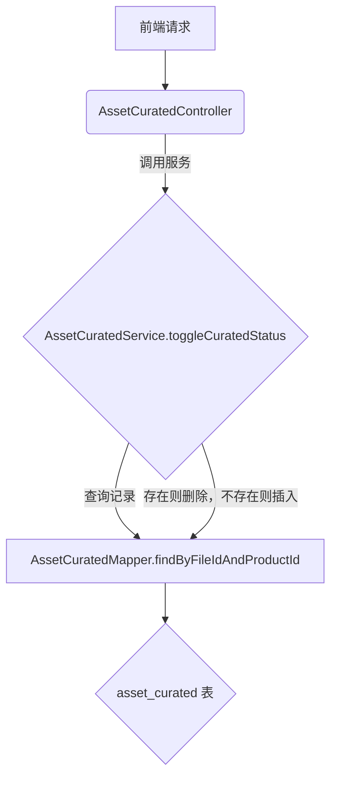

# “核心文档”标记功能改造计划

## 前端改造范围 (`d:/ProjectDir/asset-v1/web-asset-full-vue`)

### 1. `SuperPreview.vue` 改造
- **UI 变更:**
    - 在 `preview-header` 的文件名右侧、收藏按钮左侧，添加一个新的“核心文档”标记按钮。
    - 建议使用 `el-icon-medal` (奖章) 或 `el-icon-trophy` (奖杯) 作为图标，可以很好地体现“核心”或“精选”的含义。
- **状态显示:**
    - 如果文档已标记为核心文档，按钮显示为实心状态（例如，`el-icon-medal`）。
    - 如果未标记，显示为空心状态（例如，`el-icon-medal-on`）。
- **权限控制:**
    - **产品负责人/超级管理员:** 按钮始终可见且可点击。
    - **其他用户:**
        - 如果文档是核心文档，按钮可见但不可点击（仅作状态展示）。
        - 如果文档不是核心文档，按钮不可见。
- **逻辑实现:**
    - 添加 `isCurated` 数据属性，用于控制按钮的实心/空心状态。
    - 添加 `canMarkAsCurated` 计算属性，用于判断当前用户是否有权限操作。
    - 实现 `toggleCurated` 方法，点击按钮时调用后端 API，并根据返回结果更新 `isCurated` 状态，同时给出用户提示。
    - 在 `initPreview` 方法中，增加一步，即在加载文件时，调用 API 查询并设置 `isCurated` 的初始状态。

### 2. `api/asset-node.js` 改造
- 添加 `toggleCuratedStatus(fileId, productId, isCurated)` 方法，用于发送 `POST` 或 `DELETE` 请求到后端，以切换文档的“核心”状态。
- 添加 `getCuratedStatus(fileId, productId)` 方法，用于在预览加载时，获取文档的当前“核心”状态。

## 后端改造范围 (`d:/ProjectDir/asset-v1/java-asset-full-service`)

### 1. `AssetCuratedController.java` (或新建)
- 添加一个新的 RESTful 端点，例如 `POST /api/assets/curated`，用于处理“核心文档”的标记和取消标记请求。
- 请求体中应包含 `fileId` 和 `productId`。

### 2. `IAssetCuratedService.java` 和 `AssetCuratedServiceImpl.java` 改造
- 添加 `toggleCuratedStatus(fileId, productId)` 方法。
- 该方法的逻辑是：
    - 首先，根据 `fileId` 和 `productId` 查询 `asset_curated` 表。
    - 如果记录已存在，则删除该记录（取消标记）。
    - 如果记录不存在，则插入一条新记录（添加标记）。

### 3. `AssetCuratedMapper.java` 改造
- 添加 `findByFileIdAndProductId` 方法，用于根据 `fileId` 和 `productId` 精确查询一条记录。

## Mermaid 流程图

### 前端交互

### 后端流程

